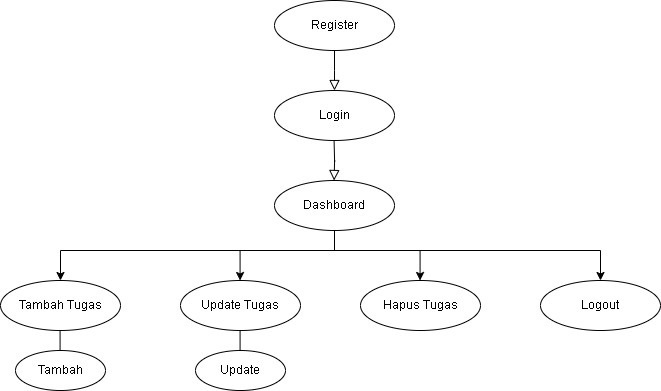

# Nama Aplikasi
Sistem Manajemen Tugas Mahasiswa

# Kegunaan Aplikasi
Aplikasi Sistem Manajemen Tugas Mahasiswa dirancang untuk membantu mahasiswa dalam mengelola tugas akademik mereka secara lebih efektif dan terorganisir. Selain itu, aplikasi ini dapat menyajikan laporan kemajuan, memungkinkan pengguna untuk memantau tugas yang sudah diselesaikan dan yang masih perlu dikerjakan,aplikasi ini memastikan mahasiswa tidak melewatkan tenggat waktu. Dengan menggunakan aplikasi ini, mahasiswa dapat lebih fokus dalam belajar, mengurangi stres akibat tugas yang menumpuk, serta meningkatkan manajemen waktu secara lebih efisien.

# Flowchart
Berikut adalah flowchart yang menggambarkan alur kerja aplikasi:
Flowchart alur kerja aplikasi : 

# Kenalan Tim
- Ryandra Surya Nandika (2213010344) - [Leader]
- Kresna Bayu Prasetyo (2213010380) - [Programmer]
- Lucky Amadya (2213010379) - [Presenter]

# Tautan Video Dokumentasi
Anda dapat menonton video dokumentasi aplikasi melalui tautan berikut:
https://youtu.be/mYAW7j7d9VE
